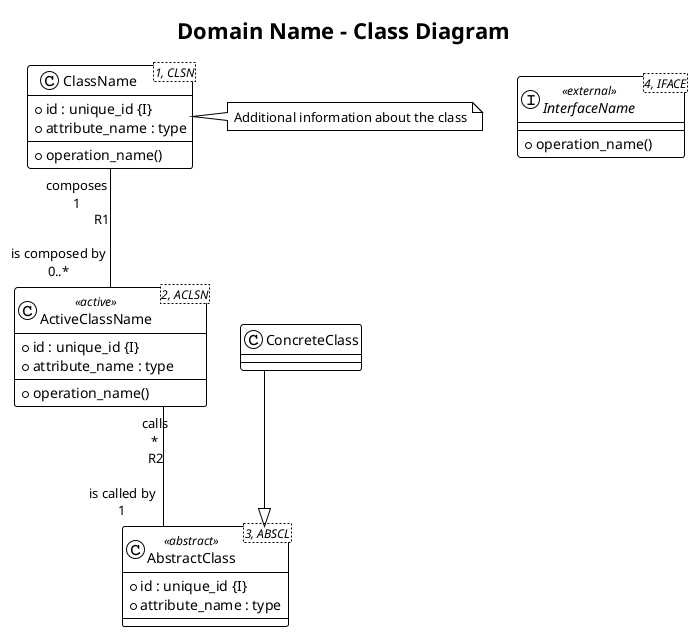
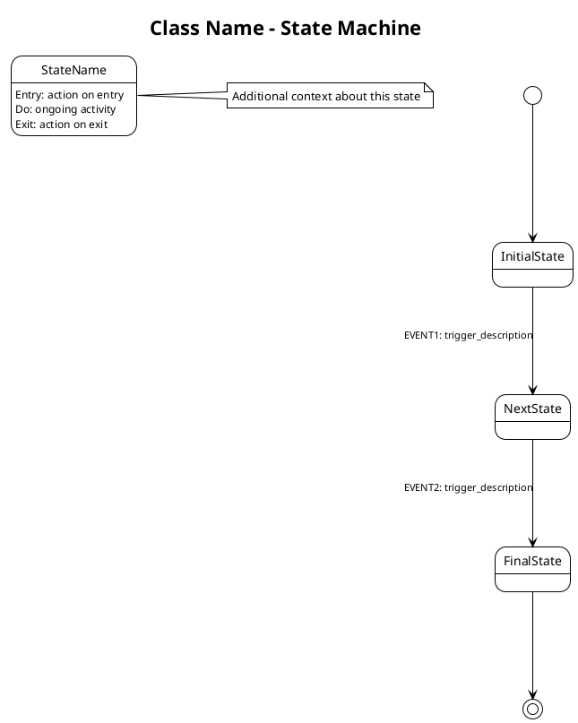

# PlantUML Style Guide for MAP Desktop Application

**Version:** 1.0
**Date:** 2025-10-08
**Purpose:** Standardize PlantUML diagram styling for consistency across all MAP Desktop Application design documentation

---

## Table of Contents

1. [General Conventions](#general-conventions)
2. [Class Diagrams](#class-diagrams)
3. [State Machine Diagrams](#state-machine-diagrams)
4. [Domain Diagrams](#domain-diagrams)
5. [Notes and Documentation](#notes-and-documentation)
6. [File Naming Conventions](#file-naming-conventions)

---

## General Conventions

### File Header
All PlantUML files SHALL begin with:


**Notes:**
- `skinparam linetype ortho` ensures all connections are straight (orthogonal) lines, not curved
- `skinparam groupInheritance 2` groups inheritance relationships for cleaner layout (class diagrams only)
- `skinparam ranksep 120` increases vertical spacing between ranks
- `skinparam nodesep 100` increases horizontal spacing between nodes (state diagrams only)
- `skinparam ArrowMessageBackgroundColor white` adds white background to transition labels to prevent overlap (state diagrams only)
- `skinparam ArrowFontSize 11` sets transition label font size (state diagrams only)

### File Footer
All PlantUML files SHALL end with:
```plantuml
@enduml
```

### Theme
- **Standard Theme:** `!theme plain`
- Rationale: Clean, professional appearance suitable for regulatory documentation

### Whitespace and Formatting
- Use blank lines to separate logical sections
- Indent nested structures consistently (2 spaces)
- Add comments using `'` for explanatory notes in source

---

## Class Diagrams

### Basic Structure Template



### Class Identification

Each class MUST have a unique class number and abbreviation specified using template parameter syntax:

**Format:**
```plantuml
class "ClassName<#, ABBREV>" as ClassName {
  attributes...
}
```

**Guidelines:**
- **Class Number:** Sequential integer starting at 1 within each domain
- **Abbreviation:**
  - All uppercase letters
  - Maximum 5 characters
  - Should be recognizable abbreviation of class name
  - Examples: `PRC` (Procedure), `STEP` (ProcedureStep), `EXRES` (ExecutionResult)
- **Alias:** Use `as ClassName` to create a shorthand for relationship definitions

**Examples:**
- `class "Procedure<1, PRC>" as Procedure`
- `class "ExecutionContext<8, EXCTX>" as ExecutionContext`
- `class "DriverDirectory<10, DDIR>" as DriverDirectory`

### Class Stereotypes

Use stereotypes to indicate special class types:

- **`<<active>>`** - Classes with state machines
- **`<<abstract>>`** - Abstract classes or interfaces
- **`<<external>>`** - External domain interfaces (not owned by current domain)
- **`<<service>>`** - Singleton services or registries

### Attribute and Operation Formatting

**Attributes:**
```plantuml
class Example {
  + public_attribute : type {I}
  - private_attribute : type
  # protected_attribute : type
  ~ package_attribute : type
}
```

**Operations:**
```plantuml
class Example {
  --
  + public_operation()
  - private_operation()
}
```

**Separators:**
- Use `--` to separate attributes from operations
- Use `==` for additional logical groupings if needed

### Identifiers (Class Keys)

Each class MUST have at least one identifier - a property or combination of properties that uniquely identifies instances of the class (analogous to database keys).

**Identifier Notation:**
- `{I}` - Primary identifier (first identifier)
- `{I2}` - Second identifier
- `{I3}` - Third identifier, etc.

**Rules:**
- At least one identifier is required per class
- If multiple properties form a compound identifier, all properties get the same identifier tag
- Identifiers are placed after the type declaration in curly brackets

**Examples:**

**Single-property identifier:**
```plantuml
class "Unit<1, UNIT>" as Unit {
  + id : unique_id {I}
  + serial_number : string
  + status : string
}
```

**Compound identifier (multiple properties):**
```plantuml
class "Procedure<1, PRC>" as Procedure {
  + id : unique_id {I}
  + name : string {I2}
  + version : string {I2}
  + filepath : string
}
```
- `id` uniquely identifies a procedure instance
- The combination of `name` + `version` also uniquely identifies a procedure (second identifier)

**Multiple identifiers:**
```plantuml
class "Driver<5, DRV>" as Driver {
  + id : unique_id {I}
  + driver_name : string {I2}
  + connection_info : string
}
```
- `id` is the primary identifier
- `driver_name` is an alternate identifier (can also uniquely identify a driver)

### Referential Attributes

Referential attributes are attributes whose values reference the identifying attribute(s) of an associated class. They are **implied by relationships** but can be explicitly shown for clarity.

**Referential Notation:**
- `{R#}` where `#` is the relationship number
- The referential attribute matches the relationship it supports

**Rules:**
- Referential attributes are optional (relationships imply them)
- Include them when it improves clarity or makes the model easier to understand
- The attribute name typically follows the pattern: `associated_class_id`
- The `{R#}` tag indicates which relationship the attribute supports

**Examples:**

**Single referential attribute:**
```plantuml
class "ExecutionResult<3, EXRES>" as ExecutionResult {
  + id : unique_id {I}
  + procedure_step_id : unique_id {R4}
  + timestamp : timestamp
  + status : string
}
```
- `procedure_step_id` references the `id` of the associated ProcedureStep
- `{R4}` indicates this supports relationship R4

**Multiple referential attributes:**
```plantuml
class "ProcedureStep<2, STEP>" as ProcedureStep {
  + id : unique_id {I}
  + procedure_id : unique_id {R1}
  + driver_id : unique_id {R6}
  + sequence_number : integer
}
```
- `procedure_id` supports relationship R1 (to Procedure)
- `driver_id` supports relationship R6 (to Driver)

**Reading referential attributes:**
- Look at the relationship number in `{R#}`
- Find the corresponding relationship definition
- The referential attribute holds the identifier value from the associated class

### Relationship Types

**Executable UML Convention:** Use simple lines without arrowheads for all associations. Each relationship MUST have:
1. A unique identifier (R1, R2, etc.)
2. Verb phrases on BOTH sides that read naturally in both directions

**Standard Association with Verb Phrases:**
```plantuml
ClassA "verb_phrase\nmultiplicity" -- "inverse_verb_phrase\nmultiplicity" ClassB : R1
```

**Format:**
- Left side: `"verb_phrase\nmultiplicity"` - verb phrase reads with the RIGHT class
- Right side: `"inverse_verb_phrase\nmultiplicity"` - verb phrase reads with the LEFT class
- Relationship identifier: `: R#`
- **Always use `\n` to separate verb phrase from multiplicity**
- If verb phrase is too long, additional `\n` characters can be used to break it into multiple lines
- Final `\n` always separates the verb phrase from the multiplicity

**Reading the relationship:**
The verb phrases are read **across** the relationship:
- Left verb + Right class: "ClassA [left_verb_phrase] ClassB"
- Right verb + Left class: "ClassB [right_verb_phrase] ClassA"

**Examples:**
- `Procedure "composes\n1" -- "is composed by\n0..*" ProcedureStep : R1`
  - Reads as: "Procedure is composed by ProcedureStep" AND "ProcedureStep composes Procedure"
- `Driver "provides\n1" -- "is provided by\n0..*" DriverCommand : R2`
  - Reads as: "Driver is provided by DriverCommand" AND "DriverCommand provides Driver"
- `ProcedureStep "uses\n*" -- "is used by\n1" Driver : R6`
  - Reads as: "ProcedureStep is used by Driver" AND "Driver uses ProcedureStep"

**Inheritance (Interface Implementation):**
```plantuml
ConcreteClass --|> AbstractClass
```
- Use `--|>` arrow for inheritance/interface implementation only
- The `skinparam groupInheritance 2` setting groups these relationships
- No relationship identifier needed for inheritance
- Example: `MonarchDriver --|> Driver`

**Verb Phrase Guidelines:**
- Use active voice verbs (e.g., "composes", "uses", "manages")
- Use passive voice for inverse (e.g., "is composed of", "is used by", "is managed by")
- Keep verb phrases concise and clear
- For long verb phrases, use additional `\n` characters to break lines:
  ```plantuml
  ClassA "verb phrase that is\nvery long\n1" -- "inverse phrase\n0..*" ClassB : R1
  ```
- Always end with `\n` before multiplicity

### Multiplicity Notation

Always include multiplicity on both ends of relationships:
- `"1"` - Exactly one
- `"0..1"` - Zero or one
- `"0..*"` or `"*"` - Zero or many
- `"1..*"` - One or many

### Notes

**Placement:**
- `note right of ClassName` - Right side
- `note left of ClassName` - Left side
- `note top of ClassName` - Above
- `note bottom of ClassName` - Below

**Multi-line notes:**
```plantuml
note right of ClassName
  Line 1
  Line 2
  Line 3
end note
```

**Formatting in notes:**
- **Bold:** `**text**`
- *Italic:* Not supported in plain theme
- Code/technical terms: Backticks not needed, just write plainly

### Class Diagram Sections

Organize classes into logical groups with comments:

```plantuml
' Core Data Classes
class Procedure { }
class ProcedureStep { }

' Active Classes (with state machines)
class ProcedureInterpreter <<active>> { }

' Support Classes
class FileLoader { }

' External Domain Interfaces
interface DataManagement <<external>> { }
```

---

## State Machine Diagrams

### Basic Structure Template



### State Formatting

**Simple State:**
```plantuml
state StateName
```

**State with Actions:**
```plantuml
state StateName {
  StateName : Entry: set status = "active"
  StateName : Do: monitor progress
  StateName : Exit: cleanup resources
}
```

**Action Types:**
- **Entry:** Actions performed when entering the state
- **Do:** Ongoing activities while in the state
- **Exit:** Actions performed when leaving the state

### Transition Formatting

**Standard Transition:**
```plantuml
State1 --> State2 : EVENT1: description
```

**Event Naming Convention:**
- Use uppercase with underscores: `EVENT_NAME`
- Or use abbreviated IDs: `PI1`, `EC1`, `U1`, `B1`, `UO1`
- Be consistent within a single state machine

**Transition Label Format:**
```plantuml
State1 --> State2 : EVENT_ID: event_description
```

Example:
```plantuml
Idle --> Loading : PI1: load_procedure_requested
Loading --> Ready : PI2: procedure_loaded_successfully
```

### Initial and Final States

**Initial State:**
```plantuml
[*] --> FirstState
```

**Final State:**
```plantuml
LastState --> [*]
```

### Composite States

Use composite states sparingly, only when substates add clarity:

```plantuml
state ParentState {
  [*] --> SubState1
  SubState1 --> SubState2
  SubState2 --> [*]
}
```

### Notes on States

```plantuml
note right of StateName
  Explanation of what happens in this state.

  May include:
  - Conditions
  - Example scenarios
  - References to requirements
end note
```

**Placement Guidelines:**
- Put notes on the right or left to avoid blocking transitions
- Keep notes concise (3-5 lines maximum)
- Use notes to explain complex decision points or business rules

### State Machine Layout

**Direction:**
- Default: Top-to-bottom flow
- Specify if needed: `left to right direction`

**Layout Management Strategies:**

For complex state machines with many transitions, use these strategies to keep diagrams clean:

1. **Hidden Transitions** - Control state positioning without showing arrows:
   ```plantuml
   StateA -[hidden]right-> StateB
   StateA -[hidden]down-> StateC
   ```

2. **Directional Arrows** - Force specific transition directions:
   ```plantuml
   StateA -down-> StateB : event
   StateA -right-> StateC : event
   StateA -up-> StateD : event
   StateA -left-> StateE : event
   ```

3. **Circular/Grouped Patterns** - Group related states in logical patterns:
   ```plantuml
   ' Create circular pattern for main operational states
   Connecting -[hidden]right-> Ready
   Ready -[hidden]down-> Busy
   Busy -[hidden]left-> Error
   Error -[hidden]up-> Connecting

   ' Then add actual transitions with directions
   Connecting -down-> Ready : connected
   Ready -down-> Busy : execute
   Busy -left-> Ready : complete
   ```

4. **Entry/Exit States Positioned Separately** - Place initialization and terminal states off to the side:
   ```plantuml
   [*] -right-> Uninitialized
   Uninitialized -right-> MainState : initialize
   ```

**Recommended Approach:**
- Identify the main operational states (the "core loop")
- Arrange core states in a circular or grid pattern using hidden transitions
- Position entry/initialization states to the side
- Use directional arrows for actual transitions to follow the pattern
- **Favor horizontal transitions** where possible - horizontal arrows have more space for labels than vertical ones
- Increase `nodesep` (e.g., to 150) if transition labels still overlap
- Use `\n` in transition labels to break long text across multiple lines

---

## Domain Diagrams

### Basic Structure Template

```plantuml
@startuml MAP_Desktop_DomainDiagram
!theme plain
skinparam linetype ortho
skinparam ranksep 120
skinparam nodesep 150
skinparam packageStyle rectangle
skinparam ArrowFontSize 11
skinparam defaultTextAlignment center
skinparam shadowing false
title MAP Desktop Application - Domain Model

' Layout directives
top to bottom direction

note as ABBREV
  <b>Domain Name</b>
  Brief mission statement describing
  the primary responsibility and
  purpose of this domain
end note

' Relationships
ABBREV1 --> ABBREV2

@enduml
```

### Layout Directives

**Direction:**
```plantuml
top to bottom direction
' or
left to right direction
```

**Skin Parameters:**
```plantuml
skinparam linetype ortho
skinparam ranksep 120
skinparam nodesep 150
skinparam packageStyle rectangle
skinparam ArrowFontSize 11
skinparam defaultTextAlignment center
skinparam shadowing false
```

**Hidden Layout Constraints:**
Use hidden links to organize layout without showing relationships:
```plantuml
Domain1 -[hidden]right-> Domain2
Domain1 -[hidden]down-> Domain3
```

### Domain Note Block Styling

Each domain is represented as a note block with a bold title and brief mission statement:

```plantuml
note as TPE
  <b>Test Procedure Engine</b>
  Executes test and programming
  procedures, coordinates drivers,
  and validates results
end note
```

**Guidelines:**
- Use domain abbreviation as the note alias (TPE, UM, DM, UI, HAL)
- First line: Domain full name in bold using `<b>...</b>`
- Following lines: Concise mission statement (2-4 lines)
- Mission statement describes primary responsibilities
- Keep text brief and focused on "what" the domain does

### Domain Relationships

```plantuml
DomainA --> DomainB
DomainA -down-> DomainC
```

**Relationship Direction:**
- `-down->` - Downward arrow
- `-up->` - Upward arrow
- `-left->` - Left arrow
- `-right->` - Right arrow
- `-->` - Automatic direction

**Relationship Labels:**
Domain diagrams typically use simple arrows without verbose labels to keep the diagram clean and focused on structure.

---

## Notes and Documentation

### Note Content Guidelines

**What to Include in Notes:**
- Purpose or responsibility of the element
- Key constraints or business rules
- Examples or scenarios
- References to requirements (REQ-XXX-NNN)
- State machine references for active classes

**What NOT to Include:**
- Implementation details (language-specific)
- Overly verbose descriptions
- Information already captured in attributes/operations

### Note Formatting

**Multi-line Notes:**
```plantuml
note right of ClassName
  First line of explanation

  Second paragraph after blank line

  - Bullet point 1
  - Bullet point 2
end note
```

**Bold Text in Notes:**
```plantuml
note right of ClassName
  **Important:** This is emphasized text
end note
```

**References:**
```plantuml
note right of ClassName
  See also: SomeOtherClass

  Trace to: REQ-DM-007
end note
```

---

## File Naming Conventions

### Format

```
[DomainName]_[DiagramType].puml
```

### Examples

**Class Diagrams:**
- `TestProcedureEngine_ClassDiagram.puml`
- `UnitManagement_ClassDiagram.puml`
- `DataManagement_ClassDiagram.puml`

**State Machine Diagrams:**
- `TestProcedureEngine_ProcedureInterpreter_StateMachine.puml`
- `UnitManagement_Unit_StateMachine.puml`
- `UnitManagement_Batch_StateMachine.puml`

**Domain Diagrams:**
- `MAP_Desktop_DomainDiagram.puml`

### Directory Structure

```
Documentation/MAP_Desktop_Application/Design/
├── MAP_Desktop_DomainDiagram.puml
├── TestProcedureEngine/
│   ├── TestProcedureEngine_ClassDiagram.puml
│   ├── TestProcedureEngine_[ClassName]_StateMachine.puml
│   └── ...
├── UnitManagement/
│   ├── UnitManagement_ClassDiagram.puml
│   ├── UnitManagement_[ClassName]_StateMachine.puml
│   └── ...
└── DataManagement/
    ├── DataManagement_ClassDiagram.puml
    └── ...
```

---

## Summary Checklist

When creating a PlantUML diagram, ensure:

- [ ] File starts with `@startuml [DiagramName]`
- [ ] Theme is set to `!theme plain`
- [ ] Line type is set to `skinparam linetype ortho` (straight connections)
- [ ] Group inheritance is set to `skinparam groupInheritance 2`
- [ ] Rank separator is set to `skinparam ranksep 120`
- [ ] Title is present and descriptive
- [ ] Each class has a class number and abbreviation: `"ClassName<#, ABBREV>" as ClassName`
- [ ] Classes have stereotypes if applicable (`<<active>>`, `<<abstract>>`, etc.)
- [ ] Each class has at least one identifier marked with `{I}`, `{I2}`, etc.
- [ ] Referential attributes marked with `{R#}` when shown explicitly (optional but recommended for clarity)
- [ ] Relationships use simple lines (`--`) with verb phrases and multiplicity on both ends
- [ ] Verb phrases read naturally in both directions
- [ ] Always use `\n` to separate verb phrase from multiplicity
- [ ] Each relationship has a unique identifier (`: R1`, `: R2`, etc.)
- [ ] Transitions are labeled with event IDs and descriptions
- [ ] Notes are used to clarify complex elements
- [ ] File ends with `@enduml`
- [ ] File naming follows convention: `[Domain]_[Type].puml`
- [ ] Consistent formatting (spacing, indentation)

---

## Examples

### Complete Class Diagram Example

```plantuml
@startuml UnitManagement_ClassDiagram
!theme plain
skinparam linetype ortho
skinparam groupInheritance 2
skinparam ranksep 120
title Unit Management - Class Diagram

' Core Data Classes
class "Unit<1, UNIT>" as Unit <<active>> {
  + id : unique_id {I}
  + serial_number : string {I2}
  + batch_id : unique_id
  + part_number : string
  + current_procedure_index : integer
  + status : string
  --
  + increment_procedure_index()
  + set_status()
}

class "Batch<2, BATCH>" as Batch <<active>> {
  + id : unique_id {I}
  + batch_number : string {I2}
  + workflow_mode : string
  --
  + add_unit()
  + is_complete()
}

class "ProcedureLogEntry<3, PLOG>" as ProcedureLogEntry {
  + id : unique_id {I}
  + unit_id : unique_id
  + timestamp : timestamp
  + procedure_name : string
  + pass_fail_status : string
}

' Relationships (xUML - simple lines with verb phrases)
Batch "contains\n1" -- "is contained by\n0..*" Unit : R1
Unit "has\n1" -- "logs\n0..*" ProcedureLogEntry : R2

note right of Unit
  **State Machine**: Unit_StateMachine.puml

  States: Created → Testing → Calibrated
  → QualityReview → Passed/Failed/Quarantined
end note

@enduml
```

### Complete State Machine Example

```plantuml
@startuml UnitManagement_Unit_StateMachine
!theme plain
skinparam linetype ortho
skinparam ranksep 120
skinparam nodesep 100
skinparam ArrowMessageBackgroundColor white
skinparam ArrowFontSize 11
title Unit - State Machine

[*] --> Created

state Created {
  Created : Entry: assign serial_number, part_number
  Created : Entry: initialize current_procedure_index = 0
}

state Testing {
  Testing : Entry: set status = "testing"
  Testing : Do: execute procedures via UnitOrchestrator
}

state Passed {
  Passed : Entry: set status = "passed"
  Passed : Entry: record completion timestamp
}

Created --> Testing : U1: start_testing
Testing --> Passed : U2: all_tests_passed
Passed --> [*]

note right of Testing
  Testing includes all test procedures
  from the procedure sequence for
  this unit's part_number.
end note

@enduml
```

---

**End of Style Guide**
