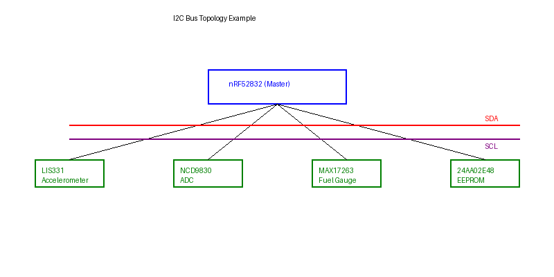
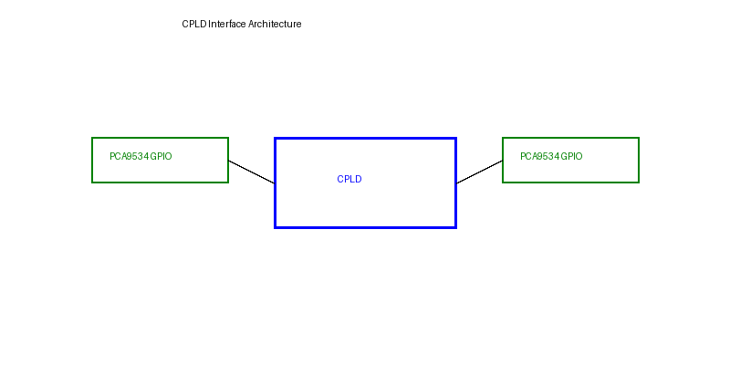

## 1. Purpose and Scope

### 1.1 Purpose

This document demonstrates **every styling element** defined in the Markdown Styling Guide (MARKDOWN_STYLING_GUIDE.md). It serves as a comprehensive test case for the Dilon Document Compiler and a reference for refining the styling guide itself.

### 1.2 Scope

This test document includes examples of:

- All heading levels
- All table formats (pipe tables with alignment, grid tables)
- Figures and images with captions
- All list types (unordered, ordered, definition lists)
- Code blocks with multiple language identifiers
- Inline code and technical notation
- Text emphasis (bold, italic, bold+italic)
- Links and cross-references
- Notes, warnings, and callouts
- Math equations and footnotes
- Proper spacing and line breaks

### 1.3 Medical Device Context

- **Device Classification**: ISO 62304 Class B Medical Device
- **Regulatory**: FDA submission requirements
- **Safety-Critical**: Real-time gamma ray detection for surgical navigation

## 2. Heading Level Examples

This section demonstrates all supported heading levels.

### 2.1 Subsection Level (Heading 2)

This is a subsection using three hashes (`###`). It represents the second level of hierarchy.

#### 2.1.1 Sub-subsection Level (Heading 3)

This is a sub-subsection using four hashes (`####`). It represents the third level of hierarchy.

### 2.2 Nested Structure Example

#### 2.2.1 First Sub-subsection

Content under first sub-subsection.

#### 2.2.2 Second Sub-subsection

Content under second sub-subsection.

## 3. Table Examples

### 3.1 Pipe Table with Default Alignment (Left) - DilonTable_List Style

This is a standard pipe table with left-aligned columns (default). This table uses **DilonTable_List** style with header row only:

| Address | Device | Function | Priority |
|---------|--------|----------|----------|
| 0x19 | LIS331 | Accelerometer | Medium |
| 0x24 | NCD9830 | ADC | High |
| 0x36 | MAX17263 | Fuel Gauge | High |
| 0x50 | 24AA02E48 | EEPROM | Low |

### 3.2 Pipe Table with Mixed Alignment - Explicit DilonTable_List

This table demonstrates left, center, and right alignment. It explicitly uses **DilonTable_List** style (though this is the default):

@@@TABLE_STYLE:DilonTable_List@@@

| Address | Device | Voltage (V) | Description |
|:--------|:------:|------------:|-------------|
| 0x19 | LIS331 | 3.3 | 3-axis accelerometer for motion detection |
| 0x24 | NCD9830 | 3.3 | 8-channel 12-bit ADC |
| 0x36 | MAX17263 | 3.3 | Fuel gauge with ModelGauge m5 |

### 3.3 Multi-line Cells with `<br>` Tags

This table attempts to show cells with line breaks using `<br>` tags:

| Field | Description |
|-------|-------------|
| Name | First line<br>Second line<br>Third line |
| Address | 0x50<br>I2C Bus 1 |
| Purpose | Read battery info<br>Monitor fuel gauge<br>Check temperature |

**ISSUE**: The `<br>` tags do not render as line breaks in Word output. Pandoc may not process HTML tags in pipe table cells. For multi-line content in cells, use grid tables instead (see Section 3.5).

### 3.4 Complex Pipe Table - DilonTable_Chart Style

This table is a matrix/cross-reference table where the first column represents register names (header column) and the top row represents bit positions (header row). This uses **DilonTable_Chart** style by placing a style marker before the table:

@@@TABLE_STYLE:DilonTable_Chart@@@

| Register | Address | Bit 7 | Bit 6 | Bit 5 | Bit 4 | Bit 3-0 |
|----------|:-------:|:-----:|:-----:|:-----:|:-----:|:-------:|
| CTRL_REG1 | 0x20 | ODR3 | ODR2 | ODR1 | ODR0 | PM[3:0] |
| CTRL_REG2 | 0x21 | BOOT | HPM1 | HPM0 | FDS | HPEN |
| CTRL_REG3 | 0x22 | IHL | PP_OD | LIR2 | I2_CFG1 | I2_CFG0 |

**Note**: In DilonTable_Chart style, both the first row AND first column should have gray background with bold text. The style marker tells the compiler to apply the specified table style during post-processing.

### 3.5 Grid Table (For Complex Content)

Grid tables support multi-paragraph cells and complex block elements:

+---------------+---------------+--------------------+
| Field         | Type          | Description        |
+===============+===============+====================+
| CRC-16        | 2 bytes       | Checksum for data  |
|               |               | integrity.         |
|               |               |                    |
|               |               | Calculated over    |
|               |               | addresses 0x02-0x15|
+---------------+---------------+--------------------+
| Board Rev     | 1 byte        | PCB revision       |
|               |               | number stored in   |
|               |               | EEPROM.            |
+---------------+---------------+--------------------+
| Serial Number | 6 bytes       | Unique 48-bit MAC  |
|               |               | address.           |
|               |               |                    |
|               |               | Format: AA:BB:CC:  |
|               |               | DD:EE:FF           |
+---------------+---------------+--------------------+

### 3.6 Incorrect Table Style Tag

The following has a Table style tag, that is not followed by a table. 

@@@TABLE_STYLE:DilonTable_Chart@@@

There should be a warning within the compilation step that says there is a floating style tag.

## 4. List Examples

### 4.1 Unordered Lists

Simple bulleted list:

- First item
- Second item
- Third item

Nested unordered list:

- Top level item 1
- Top level item 2
  - Nested item A
  - Nested item B
    - Deeply nested item
- Top level item 3

### 4.2 Ordered Lists

Simple numbered list:

1. First step
2. Second step
3. Third step

Ordered list with nested bullets:

1. Initialize I2C bus
   - Set clock frequency to 400 kHz
   - Enable internal pull-ups
2. Scan for devices
   - Check addresses 0x00-0x7F
   - Record responding devices
3. Configure each device
   - Write control registers
   - Verify configuration

### 4.3 Definition Lists

**Term 1**
:   Definition of term 1. This is a glossary-style definition.

**Term 2**
:   Definition of term 2. Useful for field definitions and technical terms.

**I2C (Inter-Integrated Circuit)**
:   A two-wire serial communication protocol using SDA (data) and SCL (clock) lines.

**Master Device**
:   The device that initiates communication and generates clock signals on the I2C bus.

**Slave Device**
:   A device that responds to requests from the master device.

## 5. Figures and Images

### 5.1 Figure with Caption



*Figure 5.1: Complete I2C Bus Topology showing nRF52832 master connected to all peripheral devices.*


**Note**: This is an example of a note following a figure caption. There are two blank lines before this note.

### 5.2 Second Figure Example



*Figure 5.2: CPLD Interface Architecture via PCA9534 GPIO extenders.*


## 6. Code and Technical Content

### 6.1 Inline Code Examples

The `i2c_write()` function sends data to the device at address `0x50`. Memory address `0x00-0x01` contains the CRC-16 checksum.

Register `CTRL_REG1` (address `0x20`) controls power mode. Set bit `PD1:PD0` to `00` for normal operation.

### 6.2 Code Blocks

#### 6.2.1 C Code Example

```c
uint8_t data[8];
i2c_read(0x50, data, 8);

void ee24aa02_read_buf(uint8_t address, uint8_t *buffer, size_t length) {
    i2c_write(0x50, &address, 1);
    i2c_read(0x50, buffer, length);
}
```

#### 6.2.2 Python Code Example

```python
def calculate_checksum(data):
    """Calculate CRC-16 checksum using polynomial 0x8005."""
    crc = 0xFFFF
    for byte in data:
        crc ^= byte << 8
        for _ in range(8):
            if crc & 0x8000:
                crc = (crc << 1) ^ 0x8005
            else:
                crc <<= 1
            crc &= 0xFFFF
    return crc
```

#### 6.2.3 Bash/Shell Commands

```bash
# Generate PlantUML diagram
plantuml -tpng diagram.puml

# Compile markdown to Word document
python generate_dilon_doc.py input.md output.docx

# Or use PowerShell alias
Compile-DilonDoc input.md
```

#### 6.2.4 VHDL Code Example

```vhdl
library IEEE;
use IEEE.STD_LOGIC_1164.ALL;

entity counter is
    Port ( clk : in STD_LOGIC;
           reset : in STD_LOGIC;
           count : out STD_LOGIC_VECTOR(7 downto 0));
end counter;
```

#### 6.2.5 Plain Text Block (No Language Identifier)

```
This is a plain text block with no syntax highlighting.
It can be used for console output or generic text content.

Line 1
Line 2
Line 3
```

#### 6.2.6 Custom Styled Single Paragraph

This example demonstrates applying a custom paragraph style using special markers. This is useful for content that needs special formatting beyond standard Pandoc styles:

@@@STYLE:SourceCode@@@
HARDWARE CONFIGURATION: Connect GPIO pin 14 to LED anode through 330Ω current-limiting resistor. Connect LED cathode to GND. Verify forward voltage drop of 2.0V at 10mA nominal current.
@@@END_STYLE@@@

**Note**: The `@@@STYLE:SourceCode@@@` and `@@@END_STYLE@@@` markers apply the SourceCode style to the paragraph between them. Both markers are automatically removed in the final Word document.

#### 6.2.7 Custom Styled Multiple Paragraphs

For applying custom styling to multiple consecutive paragraphs, use the `@@@END_STYLE@@@` marker:

@@@STYLE:SourceCode@@@
INITIALIZATION SEQUENCE:
Step 1: Apply power to VDD pin (3.3V ±5%)
Step 2: Wait 100ms for voltage stabilization
Step 3: Assert RESET pin LOW for minimum 10ms
Step 4: Release RESET pin and wait 50ms for boot sequence

VERIFICATION PROCEDURE:
Monitor STATUS register at address 0x00
Expected value: 0x42 (device ready)
If STATUS reads 0x00, repeat initialization sequence
Maximum retry attempts: 3
@@@END_STYLE@@@

**Note**: All paragraphs between `@@@STYLE:StyleName@@@` and `@@@END_STYLE@@@` receive the specified formatting. Both markers are automatically removed from the final document.

#### 6.2.8 Same Paragraph - Both Markers on One Line

This demonstrates both START and END markers on the same line:

@@@STYLE:SourceCode@@@ CONFIG_REGISTER: Write 0x3A to address 0x2C. Verify ACK signal. @@@END_STYLE@@@

**Note**: When both markers are on the same line, only that single paragraph receives the style.

#### 6.2.9 Start Marker Alone in Paragraph

This demonstrates the START marker as the only content in its paragraph:

@@@STYLE:SourceCode@@@

TIMEOUT_CONFIG: Set watchdog timer to 500ms. Enable automatic reset on timeout condition. Monitor WDOG_RESET flag in status register.

@@@END_STYLE@@@

**Note**: The START marker paragraph contains only the marker (after Pandoc processing with blank lines).

#### 6.2.10 End Marker Alone in Paragraph

This demonstrates the END marker as the only content in its paragraph:

@@@STYLE:SourceCode@@@
INTERRUPT_HANDLER: Clear pending interrupt flags before exiting ISR. Save context to stack. Restore context on return.

@@@END_STYLE@@@

**Note**: The END marker paragraph contains only the marker (after Pandoc processing with blank lines).

### 6.3 Register and Bit Field Notation

Examples of technical notation:

- Memory address `0x00-0x01` contains the CRC-16 checksum
- Register `CTRL_REG1` (address `0x20`) controls power mode
- Set bit `PD1:PD0` to `00` for normal operation
- Configure `ODR[3:0]` bits to select output data rate
- I2C address range: `0x00-0x7F` (7-bit addressing)
- Write sequence: `START`, `ADDRESS`, `WRITE`, `DATA`, `STOP`

## 7. Text Emphasis and Formatting

### 7.1 Bold Text

Use **bold** for important warnings and key terms:

**Important**: This is critical information that must be followed.

**Field Name**: Always use bold for field names in descriptions.

**Key Term**: Bold the first mention of key technical terms.

### 7.2 Italic Text

Use *italic* for emphasis and figure captions:

*Figure captions are italicized as shown in Section 5.*

The device operates in *normal mode* by default but can be configured for *low-power mode*.

### 7.3 Bold and Italic Combined

Use ***bold italic*** for critical warnings:

***WARNING***: High voltage hazard. Disconnect power before servicing.

***CRITICAL***: This operation cannot be undone.

## 8. Links and Cross-References

### 8.1 External Links

For more information, see the [Pandoc User's Guide](https://pandoc.org/MANUAL.html).

Visit the [Dilon Diagnostics website](https://www.dilondiagnostics.com) for product information.

Refer to the [I2C specification](https://www.nxp.com/docs/en/user-guide/UM10204.pdf) for protocol details.

### 8.2 Internal Cross-References

Internal cross-references use hyperlinks to navigate within the document:

See [Section 3.5](#grid-table-for-complex-content) for examples of grid tables with multi-paragraph cells.

For table styling options, refer to [Section 3.4](#complex-pipe-table---dilontable_chart-style) which demonstrates the DilonTable_Chart style with both header row and header column formatting.

The definition list format is explained in [Section 4.3](#definition-lists), showing proper use of bold terms and colon syntax.

Code examples demonstrating different language identifiers can be found in [Section 6.2](#code-blocks), including [C code](#c-code-example), [Python](#python-code-example), [Bash commands](#bashshell-commands), and [VHDL](#vhdl-code-example).

Figure formatting with proper captions is demonstrated in [Section 5.1](#figure-with-caption) and [Section 5.2](#second-figure-example).

### 8.3 Code References

Specific file and line number references:

**Code Reference**: `task_supervisor.c:87-90`

**Implementation**: `i2c_driver.c:142`

**Header File**: `device_config.h:25-45`

**Function Definition**: `main.c:315`

## 9. Notes, Warnings, and Callouts

### 9.1 Simple Notes

**Note**: This is a simple informational note using bold text.

**Note**: Always check device address before initiating communication.

### 9.2 Important and Warning Callouts

**IMPORTANT**: Critical information that must be followed to ensure proper operation.

**WARNING**: Safety or regulatory warning. Failure to comply may result in device damage or injury.

**CAUTION**: Electrostatic discharge (ESD) sensitive components. Use proper grounding.

### 9.3 Block Quotes

For longer notes or quoted text from specifications:

> This is a block quote. It can be used for longer notes,
> quoted text from datasheets, or multi-line warnings.
> The block quote format provides clear visual separation
> from regular body text.

Another example:

> The I2C specification requires that all devices release the bus
> (both SDA and SCL) after communication completes. A master device
> must ensure proper timing to avoid bus contention.

## 10. Spacing and Line Break Examples

### 10.1 Paragraph Spacing

This is the first paragraph. It is followed by one blank line.

This is the second paragraph. This is followed by two blank lines


This is a third paragraph. This is followed by a newline character and a blank line\n

This paragraph demonstrates proper spacing before a list:

- List item 1
- List item 2
- List item 3

And this paragraph follows the list with proper spacing.

### 10.2 Section Break with Horizontal Rule

The following horizontal rule can be used for section breaks:

---

Content after a horizontal rule. Pandoc may convert this to a page break in Word output.

---

## 11. Special Pandoc Features

### 11.1 Math Equations

Inline math equation: $E = mc^2$

Another inline example: The voltage is calculated as $V_{out} = \frac{DAC_{code}}{4096} \times V_{REF}$

Display math equation (centered on its own line):

$$
V_{out} = \frac{DAC_{code}}{4096} \times V_{REF}
$$

More complex equation:

$$
CRC = \sum_{i=0}^{n-1} data[i] \times x^i \mod polynomial
$$

### 11.2 Footnotes

This is a sentence with a footnote reference. [^1]

The I2C specification defines two speed modes: Standard-mode (100 kHz) and Fast-mode (400 kHz). [^2]

Footnote in table or technical context: The MAX17263 uses ModelGauge m5 algorithm. [^3]

[^1]: This is the footnote content. Footnotes appear at the bottom of the page or document.

[^2]: Ultra Fast-mode (1 MHz) and High-speed mode (3.4 MHz) are also defined but less commonly used.

[^3]: ModelGauge m5 is a patented algorithm by Maxim Integrated (now part of Analog Devices).

## 12. Requirements Traceability Example

### 12.1 Functional Requirements

- **REQ-001**: System SHALL initialize I2C bus at 400 kHz within 100ms of power-on
- **REQ-002**: System SHALL detect all connected I2C devices during initialization
- **REQ-003**: System SHALL log I2C communication errors to the error buffer
- **REQ-004**: System SHALL retry failed I2C transactions up to 3 times before reporting failure

### 12.2 Non-Functional Requirements

- **REQ-005**: I2C communication latency SHALL NOT exceed 10ms per transaction
- **REQ-006**: System SHALL support hot-plugging of I2C devices (if hardware permits)
- **REQ-007**: I2C driver SHALL be thread-safe for multi-threaded environments

## 13. References and Documentation

### 13.1 Internal Documents

- **Navigator 3.0 System Architecture**: `Documentation/Navigator_3_System_Architecture.md`
- **I2C Driver Implementation**: `dilon_counter/src/i2c_driver.c`
- **Device Configuration Header**: `dilon_counter/include/device_config.h`

### 13.2 External Datasheets and Standards

- **LIS331 Accelerometer**: STMicroelectronics, Doc ID 17116 Rev 2
- **NCD9830 ADC**: ON Semiconductor, NCD9830 Datasheet Rev 2
- **MAX17263 Fuel Gauge**: Maxim Integrated, MAX17263 Datasheet Rev 1
- **I2C Specification**: NXP UM10204, I2C-bus specification and user manual Rev 7.0

### 13.3 Regulatory Standards

- **ISO 62304**: Medical device software - Software life cycle processes
- **IEC 60601-1**: Medical electrical equipment - Part 1: General requirements for basic safety and essential performance
- **FDA 21 CFR Part 820**: Quality System Regulation

## 14. Revision History Summary

This document has undergone the following revisions:

| Revision | Date | Description | ECO Number |
|:--------:|:----:|-------------|:----------:|
| 1.0 | 2025-10-01 | Initial release | -- |
| 1.1 | 2025-10-15 | Updated Section 3.5 with new calibration data | ECO-2025-042 |

## 15. Conclusion

This test document demonstrates all styling elements defined in the Markdown Styling Guide (MARKDOWN_STYLING_GUIDE.md). It includes:

- ✅ YAML front matter with multiple revisions
- ✅ All heading levels (##, ###, ####)
- ✅ Pipe tables with all alignment types
- ✅ Grid tables for complex content
- ✅ Figures with proper captions
- ✅ All list types (unordered, ordered, definition)
- ✅ Code blocks with multiple language identifiers
- ✅ Inline code and register notation
- ✅ Bold, italic, and bold+italic text
- ✅ External links and internal cross-references
- ✅ Code references with file:line format
- ✅ Notes, warnings, and block quotes
- ✅ Horizontal rules
- ✅ Math equations (inline and display)
- ✅ Footnotes
- ✅ Proper spacing and line breaks

### 15.1 Testing Instructions

To test this document:

1. Generate Word output: `Compile-DilonDoc STYLING_TEST_TEMPLATE.md`
2. Review the generated `.docx` file
3. Verify that all styling elements render correctly
4. Identify any formatting issues or inconsistencies
5. Update the styling guide based on findings

### 15.2 Expected Output Verification

Check the following in the generated Word document:

- [ ] Title page with correct document number and revision
- [ ] Signature page with all three approvers
- [ ] Revision history table with all entries
- [ ] Table of contents with correct page numbers
- [ ] All headings styled correctly (Heading 1, 2, 3)
- [ ] Tables display correct column alignment (left, center, right)
- [ ] Figures display correctly with italicized captions
- [ ] Code blocks use "Source Code" style
- [ ] Bold and italic text render correctly
- [ ] Footnotes appear at bottom of pages
- [ ] Math equations render properly
- [ ] No formatting artifacts or errors

---

**Document Version**: 1.1
**Generated**: 2025-10-10
**Maintained By**: Dilon Engineering Team
