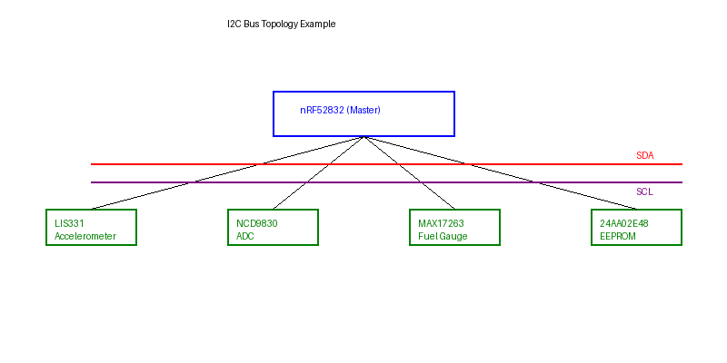
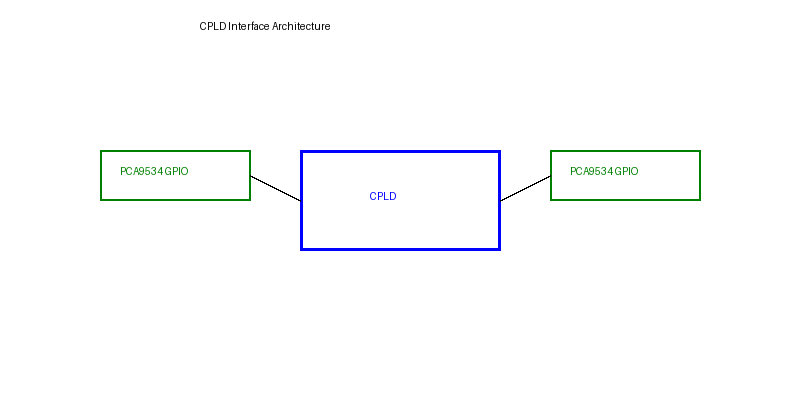

## Purpose and Scope

### Purpose

This document demonstrates **every styling element** defined in the Markdown Styling Guide (MARKDOWN_STYLING_GUIDE.md). It serves as a comprehensive test case for the Dilon Document Compiler and a reference for refining the styling guide itself.

### Scope

This test document includes examples of:

- All heading levels
- All table formats (pipe tables with alignment, grid tables)
- Figures and images with captions
- All list types (unordered, ordered, definition lists)
- Code blocks with multiple language identifiers
- Inline code and technical notation
- Text emphasis (bold, italic, bold+italic)
- Links and cross-references
- Notes, warnings, and callouts
- Math equations and footnotes
- Proper spacing and line breaks

### Medical Device Context

- **Device Classification**: ISO 62304 Class B Medical Device
- **Regulatory**: FDA submission requirements
- **Safety-Critical**: Real-time gamma ray detection for surgical navigation

## Heading Level Examples

This section demonstrates all supported heading levels.

### Subsection Level (Heading 2)

This is a subsection using three hashes (`###`). It represents the second level of hierarchy.

#### Sub-subsection Level (Heading 3)

This is a sub-subsection using four hashes (`####`). It represents the third level of hierarchy.

### Nested Structure Example

#### First Sub-subsection

Content under first sub-subsection.

#### Second Sub-subsection

Content under second sub-subsection.

## Table Examples

### Pipe Table with Default Alignment (Left) - DilonTable_List Style

This is a standard pipe table with left-aligned columns (default). This table uses **DilonTable_List** style with header row only:

| Address | Device | Function | Priority |
|---------|--------|----------|----------|
| 0x19 | LIS331 | Accelerometer | Medium |
| 0x24 | NCD9830 | ADC | High |
| 0x36 | MAX17263 | Fuel Gauge | High |
| 0x50 | 24AA02E48 | EEPROM | Low |

### Pipe Table with Mixed Alignment - Explicit DilonTable_List

This table demonstrates left, center, and right alignment. It explicitly uses **DilonTable_List** style (though this is the default):

@@@TABLE_STYLE:DilonTable_List@@@

| Address | Device | Voltage (V) | Description |
|:--------|:------:|------------:|-------------|
| 0x19 | LIS331 | 3.3 | 3-axis accelerometer for motion detection |
| 0x24 | NCD9830 | 3.3 | 8-channel 12-bit ADC |
| 0x36 | MAX17263 | 3.3 | Fuel gauge with ModelGauge m5 |

### Multi-line Cells with `<br>` Tags

This table attempts to show cells with line breaks using `<br>` tags:

| Field | Description |
|-------|-------------|
| Name | First line<br>Second line<br>Third line |
| Address | 0x50<br>I2C Bus 1 |
| Purpose | Read battery info<br>Monitor fuel gauge<br>Check temperature |

**ISSUE**: The `<br>` tags do not render as line breaks in Word output. Pandoc may not process HTML tags in pipe table cells. For multi-line content in cells, use grid tables instead (see Section 3.5).

### Complex Pipe Table - DilonTable_Chart Style

This table is a matrix/cross-reference table where the first column represents register names (header column) and the top row represents bit positions (header row). This uses **DilonTable_Chart** style by placing a style marker before the table:

@@@TABLE_STYLE:DilonTable_Chart@@@

| Register | Address | Bit 7 | Bit 6 | Bit 5 | Bit 4 | Bit 3-0 |
|----------|:-------:|:-----:|:-----:|:-----:|:-----:|:-------:|
| CTRL_REG1 | 0x20 | ODR3 | ODR2 | ODR1 | ODR0 | PM[3:0] |
| CTRL_REG2 | 0x21 | BOOT | HPM1 | HPM0 | FDS | HPEN |
| CTRL_REG3 | 0x22 | IHL | PP_OD | LIR2 | I2_CFG1 | I2_CFG0 |

**Note**: In DilonTable_Chart style, both the first row AND first column should have gray background with bold text. The style marker tells the compiler to apply the specified table style during post-processing.

### Grid Table (For Complex Content)

Grid tables support multi-paragraph cells and complex block elements:

+---------------+---------------+--------------------+
| Field         | Type          | Description        |
+===============+===============+====================+
| CRC-16        | 2 bytes       | Checksum for data  |
|               |               | integrity.         |
|               |               |                    |
|               |               | Calculated over    |
|               |               | addresses 0x02-0x15|
+---------------+---------------+--------------------+
| Board Rev     | 1 byte        | PCB revision       |
|               |               | number stored in   |
|               |               | EEPROM.            |
+---------------+---------------+--------------------+
| Serial Number | 6 bytes       | Unique 48-bit MAC  |
|               |               | address.           |
|               |               |                    |
|               |               | Format: AA:BB:CC:  |
|               |               | DD:EE:FF           |
+---------------+---------------+--------------------+

### Incorrect Table Style Tag

The following has a Table style tag, that is not followed by a table. 

@@@TABLE_STYLE:DilonTable_Chart@@@

There should be a warning within the compilation step that says there is a floating style tag.

## List Examples

### Unordered Lists

Simple bulleted list:

- First item
- Second item
- Third item

Nested unordered list:

- Top level item 1
- Top level item 2
  - Nested item A
  - Nested item B
    - Deeply nested item
- Top level item 3

### Ordered Lists

Simple auto-numbered list:

#. First step
#. Second step
#. Third step

Auto-numbered list with nested bullets:

#. Initialize I2C bus
    - Set clock frequency to 400 kHz
    - Enable internal pull-ups
#. Scan for devices
    - Check addresses 0x00-0x7F
    - Record responding devices
#. Configure each device
    - Write control registers
    - Verify configuration

Three-level nested ordered list:

#. Top level item
    #. Second level item
        #. Third level item
    #. Second level item, sibling
#. Top level item, sibling

Interrupted and continued ordered list:

#. First item
#. Second item []{#list:i2c-setup}

An interrupting paragraph describing what comes next.

@@@CONTINUE:#list:i2c-setup@@@
#. Third item (continues from 2, not a restart at 1)
#. Fourth item

### Definition Lists

**Term 1**
:   Definition of term 1. This is a glossary-style definition.

**Term 2**
:   Definition of term 2. Useful for field definitions and technical terms.

**I2C (Inter-Integrated Circuit)**
:   A two-wire serial communication protocol using SDA (data) and SCL (clock) lines.

**Master Device**
:   The device that initiates communication and generates clock signals on the I2C bus.

**Slave Device**
:   A device that responds to requests from the master device.

## Numbered Step List Examples

A forward reference, resolved before its target step is even declared
below - proving the reference is a live field keyed on the step's
bookmark, not on document order: see [](#step:hold-board-by-edges) in
the "Cross-References" section below.

### Basic Sequence with Nesting

Plain bullets only - no manually-typed numbers. Word applies native
dotted-decimal numbering itself:

@@@STEPS@@@
- Wear clean gloves before handling any board.
- Simple dirt such as lint or light dust can be blown away before wiping.
  - Hold the board by the edges. []{#step:hold-board-by-edges}
  - Wipe with **IPA** and a lint-free cloth.
@@@END_STEPS@@@

### Interrupted Sequence with `continue`

A procedure interrupted by prose, then picked back up with a bare
`continue` - which resumes numbering from step 2 above, not restart at 1:

NOTE: Clean the entire crystal but give special attention to ensure the
polished end is free of dust, as that is the bonding surface.

@@@STEPS: continue@@@
- Visually inspect both the crystal and the photomultiplier for any physical defects or anomalies such as scratches, chips, or cracks.
- Set the cleaned crystals aside on a clean lint-free cloth for installation later.
@@@END_STEPS@@@

### Digit-Adjacent Step Text

A step whose text starts with a number - a common shape in real work
instructions ("5 minutes", "10 mA") that must not corrupt the step's own
internal numbering:

@@@STEPS: id=curing@@@
- Apply epoxy to the mounting surface.
- 5 minutes of curing time is required before proceeding.
- 24 AWG wire only - do not substitute a heavier gauge.
@@@END_STEPS@@@

### Named, Non-Adjacent Sequences

Two independently-numbered named sequences, with an unrelated sequence
running in between, followed by resuming the *first* named sequence by
name - proving `continue=<name>` finds the right sequence regardless of
what ran most recently:

@@@STEPS: id=inspection@@@
- Inspect the housing for visible cracks.
- Check that all mounting screws are present.
@@@END_STEPS@@@

@@@STEPS: continue=curing@@@
- Torque the mounting screws to 4 in-lb.
@@@END_STEPS@@@

@@@STEPS: continue=inspection@@@
- Confirm the serial number label is legible.
@@@END_STEPS@@@

### Cross-References

Give a step an anchor with `[]{#step:label}` (as done above on "Hold the
board by the edges"), then reference it elsewhere with an **empty-text**
link - the number fills in live, so it stays correct even if steps are
added or removed above it:

As described in [](#step:hold-board-by-edges), always support the board
by its edges, not its face - see also [](#step:hold-board-by-edges) for
the same step referenced a second time in one sentence.

Supplying real link text instead of an empty one is left completely
untouched, exactly like a figure or section cross-reference: see
[the board-handling step](#step:hold-board-by-edges) above.

### Syntax Shown as a Documentation Example

The `@@@STEPS@@@` marker syntax itself, shown inside a fenced code block
for documentation purposes, must render as plain example text - not be
converted into a real numbered list:

```markdown
@@@STEPS@@@
- Example step one
- Example step two
@@@END_STEPS@@@
```

## Figures and Images

### Figure with Caption

{#fig:i2c-bus-topology}

**Note**: The caption above is auto-numbered by the compiler - no number was typed in the markdown. See [the figure](#fig:i2c-bus-topology) for an example of a working figure cross-reference.

### Second Figure Example

{#fig:cpld-interface}


## Code and Technical Content

### Inline Code Examples

The `i2c_write()` function sends data to the device at address `0x50`. Memory address `0x00-0x01` contains the CRC-16 checksum.

Register `CTRL_REG1` (address `0x20`) controls power mode. Set bit `PD1:PD0` to `00` for normal operation.

### Code Blocks

#### C Code Example

```c
uint8_t data[8];
i2c_read(0x50, data, 8);

void ee24aa02_read_buf(uint8_t address, uint8_t *buffer, size_t length) {
    i2c_write(0x50, &address, 1);
    i2c_read(0x50, buffer, length);
}
```

#### Python Code Example

```python
def calculate_checksum(data):
    """Calculate CRC-16 checksum using polynomial 0x8005."""
    crc = 0xFFFF
    for byte in data:
        crc ^= byte << 8
        for _ in range(8):
            if crc & 0x8000:
                crc = (crc << 1) ^ 0x8005
            else:
                crc <<= 1
            crc &= 0xFFFF
    return crc
```

#### Bash/Shell Commands

```bash
# Compile markdown to Word document
python generate_dilon_doc.py input.md output.docx

# Or use PowerShell alias
Compile-DilonDoc input.md
```

#### VHDL Code Example

```vhdl
library IEEE;
use IEEE.STD_LOGIC_1164.ALL;

entity counter is
    Port ( clk : in STD_LOGIC;
           reset : in STD_LOGIC;
           count : out STD_LOGIC_VECTOR(7 downto 0));
end counter;
```

#### Plain Text Block (No Language Identifier)

```
This is a plain text block with no syntax highlighting.
It can be used for console output or generic text content.

Line 1
Line 2
Line 3
```

#### Custom Styled Single Paragraph

This example demonstrates applying a custom paragraph style using special markers. This is useful for content that needs special formatting beyond standard Pandoc styles:

@@@STYLE:SourceCode@@@
HARDWARE CONFIGURATION: Connect GPIO pin 14 to LED anode through 330Ω current-limiting resistor. Connect LED cathode to GND. Verify forward voltage drop of 2.0V at 10mA nominal current.
@@@END_STYLE@@@

**Note**: The `@@@STYLE:SourceCode@@@` and `@@@END_STYLE@@@` markers apply the SourceCode style to the paragraph between them. Both markers are automatically removed in the final Word document.

#### Custom Styled Multiple Paragraphs

For applying custom styling to multiple consecutive paragraphs, use the `@@@END_STYLE@@@` marker:

@@@STYLE:SourceCode@@@
INITIALIZATION SEQUENCE:
Step 1: Apply power to VDD pin (3.3V ±5%)
Step 2: Wait 100ms for voltage stabilization
Step 3: Assert RESET pin LOW for minimum 10ms
Step 4: Release RESET pin and wait 50ms for boot sequence

VERIFICATION PROCEDURE:
Monitor STATUS register at address 0x00
Expected value: 0x42 (device ready)
If STATUS reads 0x00, repeat initialization sequence
Maximum retry attempts: 3
@@@END_STYLE@@@

**Note**: All paragraphs between `@@@STYLE:StyleName@@@` and `@@@END_STYLE@@@` receive the specified formatting. Both markers are automatically removed from the final document.

#### Same Paragraph - Both Markers on One Line

This demonstrates both START and END markers on the same line:

@@@STYLE:SourceCode@@@ CONFIG_REGISTER: Write 0x3A to address 0x2C. Verify ACK signal. @@@END_STYLE@@@

**Note**: When both markers are on the same line, only that single paragraph receives the style.

#### Start Marker Alone in Paragraph

This demonstrates the START marker as the only content in its paragraph:

@@@STYLE:SourceCode@@@

TIMEOUT_CONFIG: Set watchdog timer to 500ms. Enable automatic reset on timeout condition. Monitor WDOG_RESET flag in status register.

@@@END_STYLE@@@

**Note**: The START marker paragraph contains only the marker (after Pandoc processing with blank lines).

#### End Marker Alone in Paragraph

This demonstrates the END marker as the only content in its paragraph:

@@@STYLE:SourceCode@@@
INTERRUPT_HANDLER: Clear pending interrupt flags before exiting ISR. Save context to stack. Restore context on return.

@@@END_STYLE@@@

**Note**: The END marker paragraph contains only the marker (after Pandoc processing with blank lines).

### Register and Bit Field Notation

Examples of technical notation:

- Memory address `0x00-0x01` contains the CRC-16 checksum
- Register `CTRL_REG1` (address `0x20`) controls power mode
- Set bit `PD1:PD0` to `00` for normal operation
- Configure `ODR[3:0]` bits to select output data rate
- I2C address range: `0x00-0x7F` (7-bit addressing)
- Write sequence: `START`, `ADDRESS`, `WRITE`, `DATA`, `STOP`

## Text Emphasis and Formatting

### Bold Text

Use **bold** for important warnings and key terms:

**Important**: This is critical information that must be followed.

**Field Name**: Always use bold for field names in descriptions.

**Key Term**: Bold the first mention of key technical terms.

### Italic Text

Use *italic* for emphasis:

The device operates in *normal mode* by default but can be configured for *low-power mode*.

### Bold and Italic Combined

Use ***bold italic*** for critical warnings:

***WARNING***: High voltage hazard. Disconnect power before servicing.

***CRITICAL***: This operation cannot be undone.

## Links and Cross-References

### External Links

For more information, see the [Pandoc User's Guide](https://pandoc.org/MANUAL.html).

Visit the [Dilon Diagnostics website](https://www.dilondiagnostics.com) for product information.

Refer to the [I2C specification](https://www.nxp.com/docs/en/user-guide/UM10204.pdf) for protocol details.

### Internal Cross-References

Internal cross-references use hyperlinks to navigate within the document:

See [Section 3.5](#grid-table-for-complex-content) for examples of grid tables with multi-paragraph cells.

For table styling options, refer to [Section 3.4](#complex-pipe-table---dilontable_chart-style) which demonstrates the DilonTable_Chart style with both header row and header column formatting.

The definition list format is explained in [Section 4.3](#definition-lists), showing proper use of bold terms and colon syntax.

Code examples demonstrating different language identifiers can be found in [Section 6.2](#code-blocks), including [C code](#c-code-example), [Python](#python-code-example), [Bash commands](#bashshell-commands), and [VHDL](#vhdl-code-example).

Figure formatting with proper captions is demonstrated in [Section "Figure with Caption"](#figure-with-caption) and [Section "Second Figure Example"](#second-figure-example). Direct figure cross-references (not just section links) work too: see [Figure](#fig:i2c-bus-topology) and [Figure](#fig:cpld-interface).

### Code References

Specific file and line number references:

**Code Reference**: `task_supervisor.c:87-90`

**Implementation**: `i2c_driver.c:142`

**Header File**: `device_config.h:25-45`

**Function Definition**: `main.c:315`

## Notes, Warnings, and Callouts

### Simple Notes

**Note**: This is a simple informational note using bold text.

**Note**: Always check device address before initiating communication.

### Important and Warning Callouts

**IMPORTANT**: Critical information that must be followed to ensure proper operation.

**WARNING**: Safety or regulatory warning. Failure to comply may result in device damage or injury.

**CAUTION**: Electrostatic discharge (ESD) sensitive components. Use proper grounding.

### Block Quotes

For longer notes or quoted text from specifications:

> This is a block quote. It can be used for longer notes,
> quoted text from datasheets, or multi-line warnings.
> The block quote format provides clear visual separation
> from regular body text.

Another example:

> The I2C specification requires that all devices release the bus
> (both SDA and SCL) after communication completes. A master device
> must ensure proper timing to avoid bus contention.

## Spacing and Line Break Examples

### Paragraph Spacing

This is the first paragraph. It is followed by one blank line.

This is the second paragraph. This is followed by two blank lines


This is a third paragraph. This is followed by a newline character and a blank line\n

This paragraph demonstrates proper spacing before a list:

- List item 1
- List item 2
- List item 3

And this paragraph follows the list with proper spacing.

### Section Break with Horizontal Rule

The following horizontal rule can be used for section breaks:

---

Content after a horizontal rule. Pandoc may convert this to a page break in Word output.

---

## Special Pandoc Features

### Math Equations

Inline math equation: $E = mc^2$

Another inline example: The voltage is calculated as $V_{out} = \frac{DAC_{code}}{4096} \times V_{REF}$

Display math equation (centered on its own line):

$$
V_{out} = \frac{DAC_{code}}{4096} \times V_{REF}
$$

More complex equation:

$$
CRC = \sum_{i=0}^{n-1} data[i] \times x^i \mod polynomial
$$

### Footnotes

This is a sentence with a footnote reference. [^1]

The I2C specification defines two speed modes: Standard-mode (100 kHz) and Fast-mode (400 kHz). [^2]

Footnote in table or technical context: The MAX17263 uses ModelGauge m5 algorithm. [^3]

[^1]: This is the footnote content. Footnotes appear at the bottom of the page or document.

[^2]: Ultra Fast-mode (1 MHz) and High-speed mode (3.4 MHz) are also defined but less commonly used.

[^3]: ModelGauge m5 is a patented algorithm by Maxim Integrated (now part of Analog Devices).

## Requirements Traceability Example

### Functional Requirements

- **REQ-001**: System SHALL initialize I2C bus at 400 kHz within 100ms of power-on
- **REQ-002**: System SHALL detect all connected I2C devices during initialization
- **REQ-003**: System SHALL log I2C communication errors to the error buffer
- **REQ-004**: System SHALL retry failed I2C transactions up to 3 times before reporting failure

### Non-Functional Requirements

- **REQ-005**: I2C communication latency SHALL NOT exceed 10ms per transaction
- **REQ-006**: System SHALL support hot-plugging of I2C devices (if hardware permits)
- **REQ-007**: I2C driver SHALL be thread-safe for multi-threaded environments

## References and Documentation

### Internal Documents

- **Navigator 3.0 System Architecture**: `Documentation/Navigator_3_System_Architecture.md`
- **I2C Driver Implementation**: `dilon_counter/src/i2c_driver.c`
- **Device Configuration Header**: `dilon_counter/include/device_config.h`

### External Datasheets and Standards

- **LIS331 Accelerometer**: STMicroelectronics, Doc ID 17116 Rev 2
- **NCD9830 ADC**: ON Semiconductor, NCD9830 Datasheet Rev 2
- **MAX17263 Fuel Gauge**: Maxim Integrated, MAX17263 Datasheet Rev 1
- **I2C Specification**: NXP UM10204, I2C-bus specification and user manual Rev 7.0

### Regulatory Standards

- **ISO 62304**: Medical device software - Software life cycle processes
- **IEC 60601-1**: Medical electrical equipment - Part 1: General requirements for basic safety and essential performance
- **FDA 21 CFR Part 820**: Quality System Regulation

## Revision History Summary

This document has undergone the following revisions:

| Revision | Date | Description | ECO Number |
|:--------:|:----:|-------------|:----------:|
| 1.0 | 2025-10-01 | Initial release | -- |
| 1.1 | 2025-10-15 | Updated Section 3.5 with new calibration data | ECO-2025-042 |

## Automatic Section Numbering Verification

None of the headings in this section have a number typed into their markdown text. The Word templates link the Heading 2/3/4 styles to an automatic multilevel list, so Word generates the "N." / "N.M" / "N.M.P" numbers itself, purely from each heading's position in the document. The expected number is called out after each heading below so it can be checked against what Word actually renders; if a number doesn't match (or is missing/doubled), the template's numbering setup has a problem.

This is the 16th major (`##`) section in the document, so it should render as **16.**

### First Subsection

Expected Word auto-number: **16.1**

#### First Nested Item

Expected Word auto-number: **16.1.1**

#### Second Nested Item

Expected Word auto-number: **16.1.2** — proves the sub-subsection counter increments across siblings under the same subsection.

### Second Subsection

Expected Word auto-number: **16.2**

#### First Nested Item

Expected Word auto-number: **16.2.1** — reuses the heading title "First Nested Item" from the previous subsection on purpose: the counter must reset to 1 here rather than continuing as 16.1.3.

### Third Subsection

Expected Word auto-number: **16.3**

This subsection has no `####` children, proving a subsection doesn't need nested headings for the numbering to stay correct going into the next major section.

## Conclusion

This test document demonstrates all styling elements defined in the Markdown Styling Guide (MARKDOWN_STYLING_GUIDE.md). It includes:

- ✅ YAML front matter with multiple revisions
- ✅ All heading levels (##, ###, ####)
- ✅ Pipe tables with all alignment types
- ✅ Grid tables for complex content
- ✅ Figures with proper captions
- ✅ All list types (unordered, ordered, definition)
- ✅ Numbered step lists (`@@@STEPS@@@`) - nesting, interrupted `continue`, named/non-adjacent sequences, and cross-references
- ✅ Code blocks with multiple language identifiers
- ✅ Inline code and register notation
- ✅ Bold, italic, and bold+italic text
- ✅ External links and internal cross-references
- ✅ Code references with file:line format
- ✅ Notes, warnings, and block quotes
- ✅ Horizontal rules
- ✅ Math equations (inline and display)
- ✅ Footnotes
- ✅ Proper spacing and line breaks
- ✅ Automatic Word-native section numbering (no manually-typed heading numbers)
- ✅ Automatic Word-native figure numbering and cross-references (no manually-typed figure numbers)

### Testing Instructions

To test this document:

1. Generate Word output: `Compile-DilonDoc STYLING_TEST_TEMPLATE.md`
2. Review the generated `.docx` file
3. Verify that all styling elements render correctly
4. Identify any formatting issues or inconsistencies
5. Update the styling guide based on findings

### Expected Output Verification

Check the following in the generated Word document:

- [ ] Title page with correct document number and revision
- [ ] Signature page with all three approvers
- [ ] Revision history table with all entries
- [ ] Table of contents with correct page numbers
- [ ] All headings styled correctly (Heading 1, 2, 3)
- [ ] Headings show single, correctly-nested auto-numbers ("16.", "16.1", "16.1.1") in the "Automatic Section Numbering Verification" section — no missing or doubled numbers
- [ ] Tables display correct column alignment (left, center, right)
- [ ] Figures display correctly with italicized, centered "Figure N.M - Description" captions - no manually-typed numbers, no missing/doubled numbers
- [ ] Ctrl+click on "the figure" in the "Figure with Caption" note jumps to that figure
- [ ] "Ordered Lists" renders auto-numbered (no hand-typed digits) via the "Dilon Step List" style, visually consistent with the step lists below
- [ ] "Three-level nested ordered list" shows correct dotted-decimal numbering (`1.`, `1.1.`, `1.1.1.`) at all three levels
- [ ] "Interrupted and continued ordered list" continues from 3 (not restart at 1) across the interrupting paragraph
- [ ] "Numbered Step List Examples" steps show native, correctly-nested dotted-decimal numbers (`1.`, `1.1`, `1.2`) - no manually-typed digits
- [ ] The "Interrupted Sequence with `continue`" steps continue from 2 (not restart at 1) despite the intervening NOTE
- [ ] The "Digit-Adjacent Step Text" steps render correctly - no corrupted/skipped numbers from the "5 minutes"/"24 AWG" text
- [ ] The two named sequences ("inspection" and "curing") each number independently, and resuming "curing" via `continue=curing` picks up where it left off despite "inspection" running in between
- [ ] Ctrl+click on any of the three empty-text step references to "hold the board by the edges" (including the forward reference above "Basic Sequence with Nesting") jumps to that step, and each displays the correct live step number
- [ ] "the board-handling step" (real link text) renders as a plain hyperlink, not a live step-number field
- [ ] The `@@@STEPS@@@` syntax shown in the fenced code block under "Syntax Shown as a Documentation Example" renders as plain code text - not converted into a real numbered list
- [ ] "IPA" in the first nested step renders bold
- [ ] Code blocks use "Source Code" style
- [ ] Bold and italic text render correctly
- [ ] Footnotes appear at bottom of pages
- [ ] Math equations render properly
- [ ] No formatting artifacts or errors

---

**Document Version**: 1.1
**Generated**: 2025-10-10
**Maintained By**: Dilon Engineering Team
